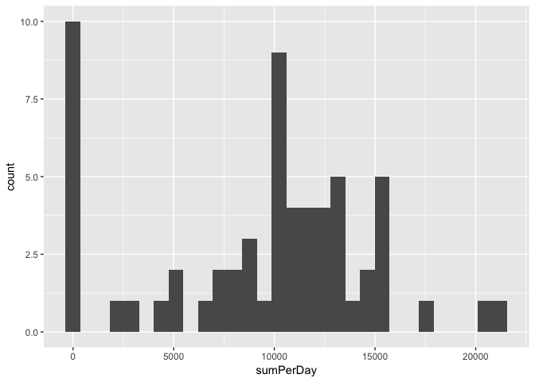
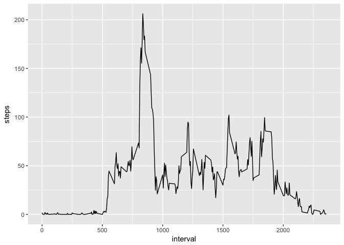
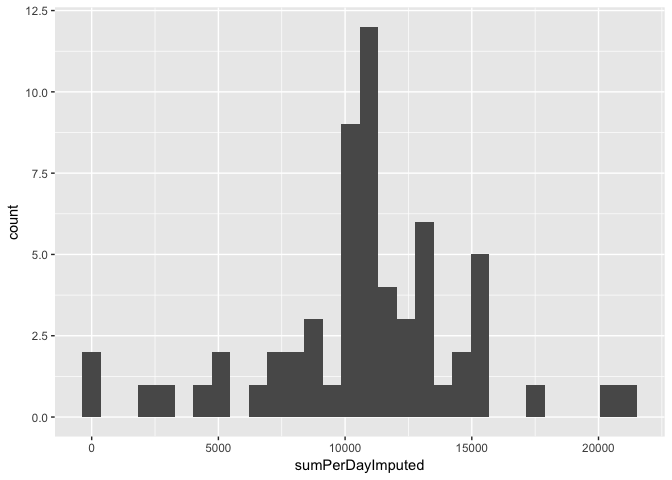
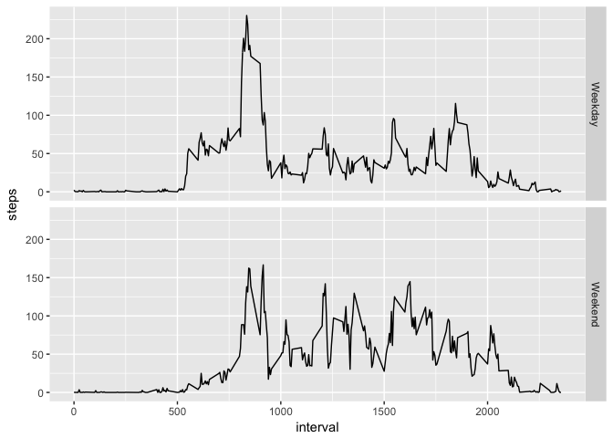

# Reproducible Research: Peer Assessment 1


## Loading and preprocessing the data


```r
dat <- read.csv("activity.csv")
dat <- transform(dat, date = as.Date(date))
```

## What is mean total number of steps taken per day?
1.  Calculate the total number of steps taken per day

```r
sumPerDay <- with(dat, tapply(steps, as.factor(date), sum, na.rm=TRUE))
```

2.  Make a histogram of the total number of steps taken each day

```r
library(ggplot2)
qplot(sumPerDay, bins = 30)
```

<!-- -->

3.  Calculate and report the mean and median of the total number of steps taken per day

```r
mean(sumPerDay)
```

```
## [1] 9354.23
```

```r
median(sumPerDay)
```

```
## [1] 10395
```


## What is the average daily activity pattern?
1.  Make a time series plot of the 5-minute interval (x-axis) and the average number of steps taken, averaged across all days (y-axis)

```r
library(ggplot2)
meanPerInterval = with(dat, tapply(steps, as.factor(interval),mean, na.rm=TRUE))
meanIntervel = data.frame(interval = unique(dat$interval), steps = meanPerInterval)
g <- ggplot(meanIntervel, aes(interval,steps)) + geom_line()
    print(g)
```

<!-- -->

2.  Which 5-minute interval, on average across all the days in the dataset, contains the maximum number of steps?

```r
    meanIntervel$interval[which.max(meanIntervel$steps)]
```

```
## [1] 835
```

## Imputing missing values
1.  Calculate and report the total number of missing values in the dataset

```r
sum(complete.cases(dat) == FALSE)
```

```
## [1] 2304
```

2.  Devise a strategy for filling in all of the missing values in the dataset. The strategy does not need to be sophisticated. For example, you could use the mean/median for that day, or the mean for that 5-minute interval, etc.  
*I use the mean for that 5-min interval across all days.*

3.  Create a new dataset that is equal to the original dataset but with the missing data filled in.

```r
imputed <- transform(dat, steps = ifelse(is.na(steps), meanIntervel$steps[match(interval, meanIntervel$interval)],steps))
```

4.  Make a histogram of the total number of steps taken each day

```r
sumPerDayImputed = with(imputed, tapply(steps, as.factor(date),sum ))
qplot(sumPerDayImputed, bins = 30)
```

<!-- -->

and Calculate and report the mean and median total number of steps taken per day

```r
mean(sumPerDayImputed)
```

```
## [1] 10766.19
```

```r
median(sumPerDayImputed)
```

```
## [1] 10766.19
```
Do these values differ from the estimates from the first part of the assignment?  
*YES*

 What is the impact of imputing missing data on the estimates of the total daily number of steps?  
*By imputing the data we remove the skewness of the original distribution due to NA values.* 

## Are there differences in activity patterns between weekdays and weekends?
1.  Create a new factor variable in the dataset with two levels – “weekday” and “weekend” indicating whether a given date is a weekday or weekend day.

```r
imputed$isWeekday <- ifelse(is.na(match(weekdays(imputed$date),c("Saturday", "Sunday"))), "Weekday", "Weekend")
```

2.  Make a panel plot containing a time series plot of the 5-minute interval (x-axis) and the average number of steps taken, averaged across all weekday days or weekend days (y-axis).

```r
ag <- aggregate(steps ~interval +isWeekday, data = imputed, mean)
g3 <- ggplot(ag, aes(x= interval, y=steps)) + geom_line() + facet_grid(isWeekday~.)
print(g3)
```

<!-- -->
